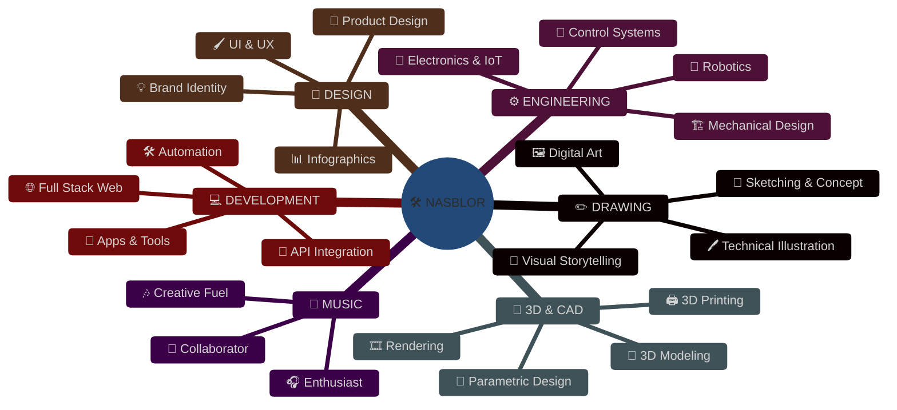
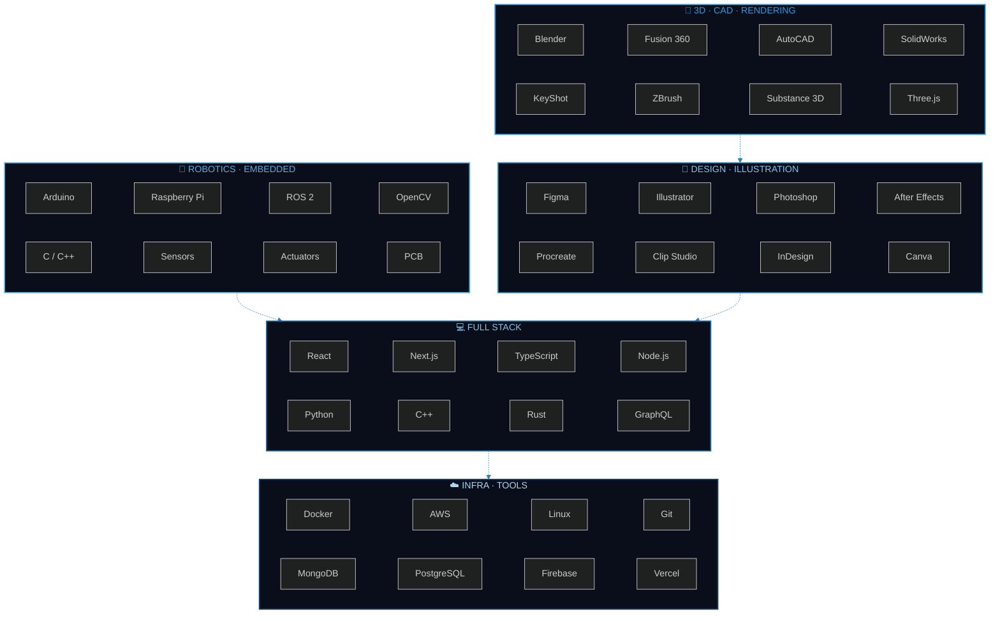
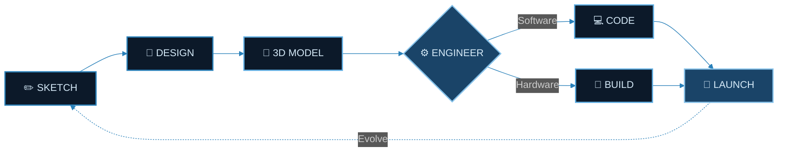
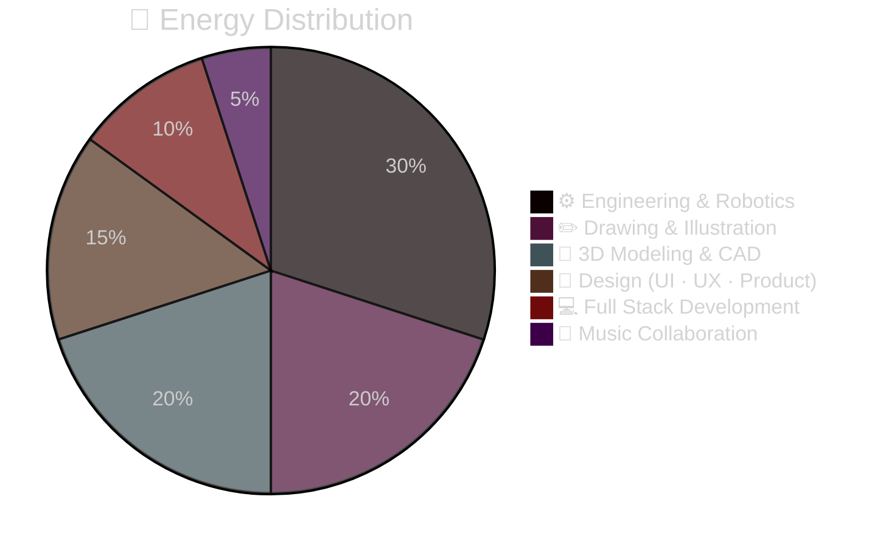

<div align="center">


<a href="https://git.io/typing-svg">

</a>

<br>


<br><br>

<table>
<tr>
<td></td>
<td></td>
<td></td>
</tr>
</table>

</div>

<br>

<!-- ═══════════════════════════════════════════════════════════ -->

<div align="center">

##  &nbsp; 𝗤𝗨𝗘𝗠 𝗦𝗢𝗨 𝗘𝗨 &nbsp; 

<br>



</div>

<br>

<!-- ═══════════════════════════════════════════════════════════ -->

<div align="center">

##  &nbsp; 𝗥𝗘𝗗𝗘𝗦 &nbsp; 

<br>

<a href="https://instagram.com/nasblor"></a>
&nbsp;
<a href="https://youtube.com/@nasblor"></a>
&nbsp;
<a href="https://twitter.com/nasblor"></a>
&nbsp;
<a href="https://threads.net/@nasblor"></a>
&nbsp;
<a href="https://tiktok.com/@nasblor"></a>

<br><br>

<a href="https://github.com/nasblor"></a>
&nbsp;
<a href="https://behance.net/nasblor"></a>
&nbsp;
<a href="https://dribbble.com/nasblor"></a>
&nbsp;
<a href="https://figma.com/@nasblor"></a>
&nbsp;
<a href="https://linkedin.com/in/nasblor"></a>

</div>

<br>

<!-- ═══════════════════════════════════════════════════════════ -->

<div align="center">

##  &nbsp; 𝗧𝗘𝗖𝗛 𝗦𝗧𝗔𝗖𝗞 &nbsp; 

<br>



<br>


<br>


<br>


</div>

<br>

<!-- ═══════════════════════════════════════════════════════════ -->

<div align="center">

##  &nbsp; 𝗪𝗢𝗥𝗞𝗙𝗟𝗢𝗪 &nbsp; 

<br>



<br>

```js
const nasblor = {
  crafts: ["Drawing", "Engineering", "Robotics", "3D", "Design"],
  passion: "Music",
  philosophy: "Precision in engineering, soul in design",
  process: "Sketch → Model → Engineer → Build → Repeat",
};

while (nasblor.isCreating) {
  const idea    = await nasblor.sketch();
  const model   = await nasblor.render3D(idea);
  const machine = await nasblor.engineer(model);
  await nasblor.deploy(machine);
}
```

</div>

<br>

<!-- ═══════════════════════════════════════════════════════════ -->

<div align="center">

##  &nbsp; 𝗦𝗧𝗔𝗧𝗦 &nbsp; 

<br>


<br>


<br>


</div>

<br>

<!-- ═══════════════════════════════════════════════════════════ -->

<div align="center">

##  &nbsp; 𝗙𝗢𝗖𝗨𝗦 &nbsp; 

<br>



</div>

<br>

<!-- ═══════════════════════════════════════════════════════════ -->

<div align="center">


<br>

[](https://github.com/ryo-ma/github-profile-trophy)

<br>


<br>

<a href="https://github.com/nasblor"></a>

<br><br>


<br><br>


</div>
