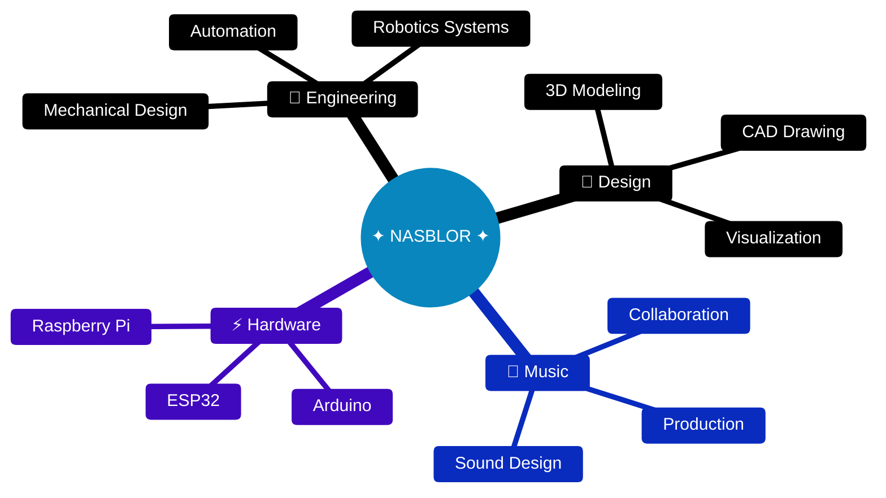
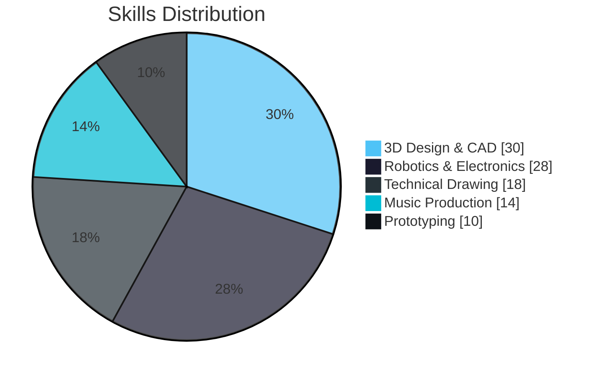
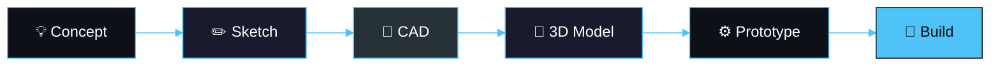

&nbsp;&nbsp;&nbsp;&nbsp;&nbsp;&nbsp;&nbsp;&nbsp;

&nbsp;&nbsp;&nbsp;&nbsp;&nbsp;&nbsp;&nbsp;&nbsp;

## ◈ ABOUT ◈

&nbsp;&nbsp;&nbsp;&nbsp;&nbsp;&nbsp;

Engineering student passionate about **robotics** and **automation** · Creating **3D models** and **technical designs**
 **Music enthusiast** collaborating on creative projects · Transforming ideas into **functional prototypes**

`🤖 Robotics`&nbsp;&nbsp;`📐 CAD`&nbsp;&nbsp;`🎨 3D Art`&nbsp;&nbsp;`🎵 Music`&nbsp;&nbsp;`✏️ Drawing`&nbsp;&nbsp;`⚙️ Prototyping`

## ◈ TECH STACK ◈

&nbsp;&nbsp;&nbsp;&nbsp;

&nbsp;&nbsp;&nbsp;&nbsp;

&nbsp;&nbsp;&nbsp;

## ◈ EXPERTISE ◈

## ◈ WORKFLOW ◈

## ◈ GITHUB STATS ◈

&nbsp;&nbsp;&nbsp;

## ◈ LET'S CONNECT ◈

&nbsp;&nbsp;**Open for collaborations and creative projects**&nbsp;&nbsp;

&nbsp;&nbsp;&nbsp;

🎵 Vibing to beats while designing the next innovation 🎧

