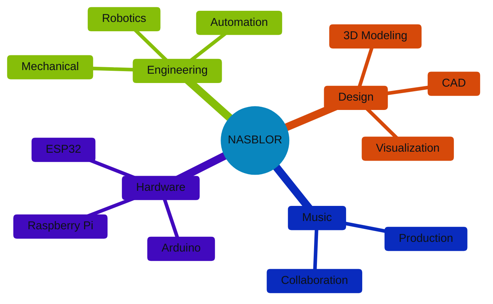
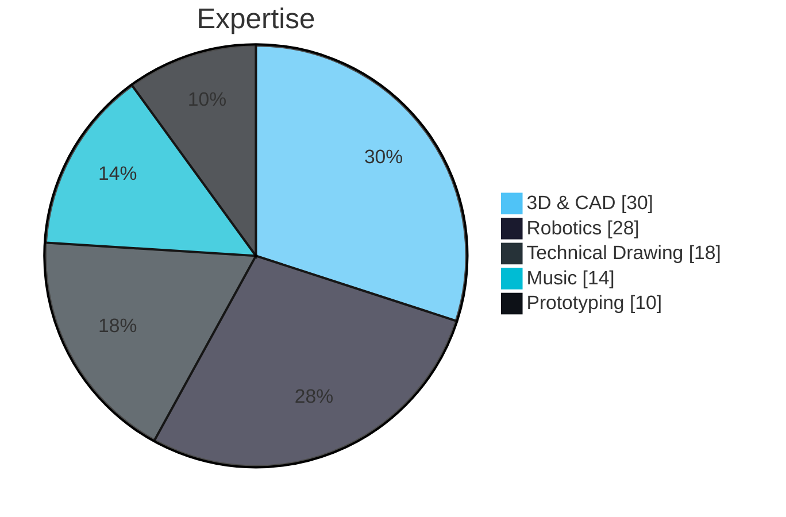
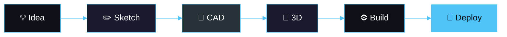

&nbsp;&nbsp;&nbsp;&nbsp;

## ◈ ABOUT

Engineering student from **Brazil** passionate about **robotics**, **3D design** and **music collaboration**
 Building innovative solutions • Transforming ideas into functional prototypes

`🤖 Robotics` · `📐 CAD` · `🎨 3D Art` · `🎵 Music` · `✏️ Drawing` · `⚙️ Prototyping`

## ◈ STACK

**Robotics & Hardware**
 &nbsp;&nbsp;&nbsp;&nbsp;

**Design & 3D**
 &nbsp;&nbsp;&nbsp;

**Creative**
 &nbsp;&nbsp;

## ◈ SKILLS

## ◈ WORKFLOW

## ◈ STATS

&nbsp;&nbsp;

## ◈ CONNECT

&nbsp;**Open for collaborations**&nbsp;

&nbsp;

🎵 Currently vibing to some beats while designing the next big thing

