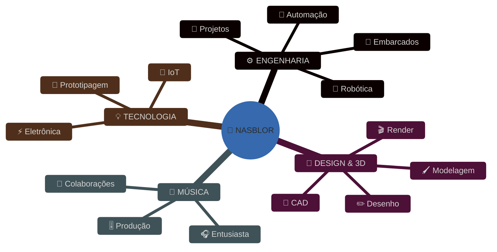
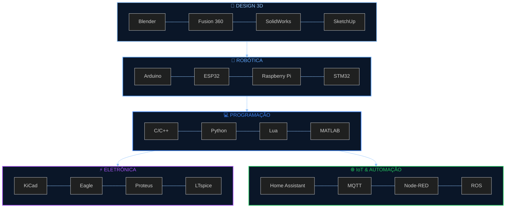
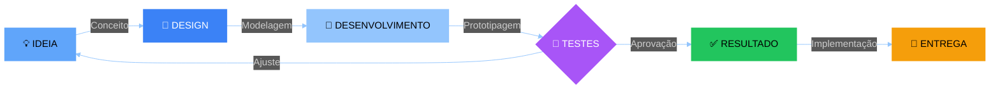
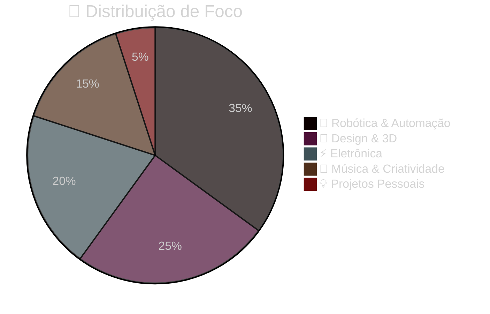

## ◈ 𝗤𝗨𝗘𝗠 𝗦𝗢𝗨 ◈

```mermaid
%%{init: {'theme':'dark','themeVariables':{'primaryColor':'#60a5fa','primaryTextColor':'#ffffff','primaryBorderColor':'#60a5fa','lineColor':'#93c5fd','secondaryColor':'#1e3a5f','tertiaryColor':'#0a1628','fontSize':'14px'}}}%%
mindmap
  root((🤖 NASBLOR))
    ⚙️ ENGENHARIA
      🦾 Robótica
      🔌 Automação
      📐 Projetos
      🧠 Embarcados
    🎨 DESIGN & 3D
      🖌️ Modelagem
      ✏️ Desenho
      🎬 Render
      📐 CAD
    🎵 MÚSICA
      🎧 Entusiasta
      🎹 Colaborações
      🎚️ Produção
    💡 TECNOLOGIA
      🔧 Prototipagem
      🤖 IoT
      ⚡ Eletrônica
```

## ◈ 𝗖𝗢𝗡𝗘𝗫Õ𝗘𝗦 ◈

## ◈ 𝗧𝗘𝗖𝗡𝗢𝗟𝗢𝗚𝗜𝗔𝗦 ◈

```mermaid
%%{init: {'theme':'dark','themeVariables':{'primaryColor':'#60a5fa','primaryTextColor':'#fff','primaryBorderColor':'#60a5fa','lineColor':'#93c5fd','secondaryColor':'#0a1628','tertiaryColor':'#1e3a5f'}}}%%
graph TB
    subgraph ROBOTICA ["🤖 ROBÓTICA"]
        direction LR
        AR[Arduino] --- ESP[ESP32] --- PI[Raspberry Pi] --- STM[STM32]
    end
    subgraph PROGRAMACAO ["💻 PROGRAMAÇÃO"]
        direction LR
        CPP[C/C++] --- PY[Python] --- LUA[Lua] --- MAT[MATLAB]
    end
    subgraph DESIGN3D ["🎨 DESIGN 3D"]
        direction LR
        BL[Blender] --- FU[Fusion 360] --- SW[SolidWorks] --- SK[SketchUp]
    end
    subgraph ELETRONICA ["⚡ ELETRÔNICA"]
        direction LR
        KI[KiCad] --- EA[Eagle] --- PR[Proteus] --- LT[LTspice]
    end
    subgraph IOT ["🌐 IoT & AUTOMAÇÃO"]
        direction LR
        HA[Home Assistant] --- MQ[MQTT] --- NO[Node-RED] --- ROS[ROS]
    end
    ROBOTICA --> PROGRAMACAO --> ELETRONICA
    PROGRAMACAO --> IOT
    DESIGN3D --> ROBOTICA
    style ROBOTICA fill:#0a1628,stroke:#60a5fa,stroke-width:2px,color:#60a5fa
    style PROGRAMACAO fill:#0a1628,stroke:#3b82f6,stroke-width:2px,color:#3b82f6
    style DESIGN3D fill:#0a1628,stroke:#93c5fd,stroke-width:2px,color:#93c5fd
    style ELETRONICA fill:#0a1628,stroke:#a855f7,stroke-width:2px,color:#a855f7
    style IOT fill:#0a1628,stroke:#22c55e,stroke-width:2px,color:#22c55e
```

## ◈ 𝗙𝗟𝗨𝗫𝗢 𝗗𝗘 𝗧𝗥𝗔𝗕𝗔𝗟𝗛𝗢 ◈

```mermaid
%%{init: {'theme':'dark','themeVariables':{'primaryColor':'#60a5fa','primaryTextColor':'#000','lineColor':'#93c5fd','secondaryColor':'#1e3a5f','tertiaryColor':'#0a1628'}}}%%
flowchart LR
    A["💡 IDEIA"] -->|Conceito| B["📐 DESIGN"]
    B -->|Modelagem| C["🔧 DESENVOLVIMENTO"]
    C -->|Prototipagem| D{"🧪 TESTES"}
    D -->|Ajuste| A
    D -->|Aprovação| E["✅ RESULTADO"]
    E -->|Implementação| F["🚀 ENTREGA"]
    style A fill:#60a5fa,stroke:#60a5fa,color:#000,stroke-width:2px
    style B fill:#3b82f6,stroke:#3b82f6,color:#fff,stroke-width:2px
    style C fill:#93c5fd,stroke:#93c5fd,color:#000,stroke-width:2px
    style D fill:#a855f7,stroke:#a855f7,color:#fff,stroke-width:2px
    style E fill:#22c55e,stroke:#22c55e,color:#000,stroke-width:2px
    style F fill:#f59e0b,stroke:#f59e0b,color:#000,stroke-width:2px
```

## ◈ 𝗘𝗦𝗧𝗔𝗧Í𝗦𝗧𝗜𝗖𝗔𝗦 ◈

## ◈ 𝗔𝗥𝗘𝗔𝗦 𝗗𝗘 𝗜𝗡𝗧𝗘𝗥𝗘𝗦𝗦𝗘 ◈

```mermaid
%%{init: {'theme':'dark','themeVariables':{'primaryColor':'#60a5fa','primaryTextColor':'#fff','lineColor':'#93c5fd'}}}%%
pie title 🎯 Distribuição de Foco
    "🤖 Robótica & Automação" : 35
    "🎨 Design & 3D" : 25
    "⚡ Eletrônica" : 20
    "🎵 Música & Criatividade" : 15
    "💡 Projetos Pessoais" : 5
```

 <b>Vamos criar algo incrível juntos!</b> 

