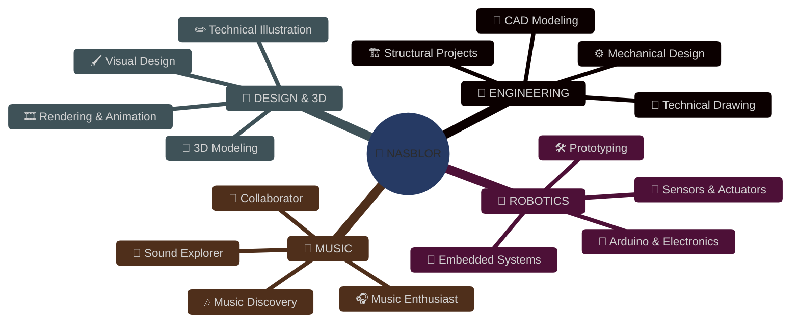
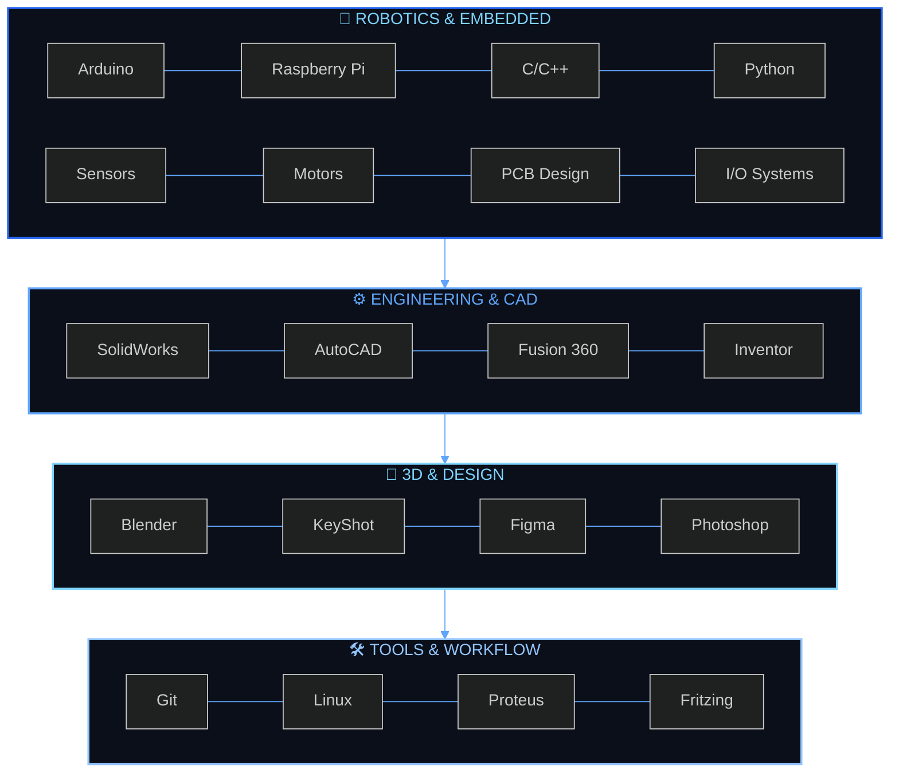
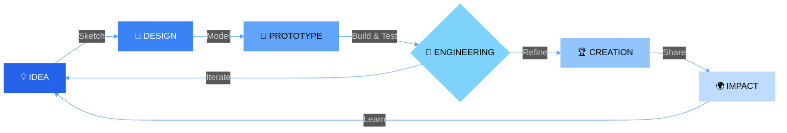

 

 

---

## ◈ 𝗪𝗛𝗢 𝗜𝗦 𝗡𝗔𝗦𝗕𝗟𝗢𝗥 ◈

 

 

 

 

---

## ◈ 𝗖𝗢𝗡𝗡𝗘𝗖𝗧 ◈

 
<b>📱 𝗦𝗢𝗖𝗜𝗔𝗟</b>
 

  
<b>🎨 𝗖𝗥𝗘𝗔𝗧𝗜𝗩𝗘</b>
 

---

## ◈ 𝗧𝗘𝗖𝗛 𝗔𝗥𝗦𝗘𝗡𝗔𝗟 ◈

---

## ◈ 𝗖𝗥𝗘𝗔𝗧𝗢𝗥 𝗦𝗧𝗔𝗧𝗦 ◈

 

 

 

---

## ◈ 𝗪𝗢𝗥𝗞𝗙𝗟𝗢𝗪 ◈

---

## ◈ 𝗔𝗖𝗛𝗜𝗘𝗩𝗘𝗠𝗘𝗡𝗧𝗦 ◈

 

 
 <b>Let's connect and build something extraordinary!</b> 
  

 

  

