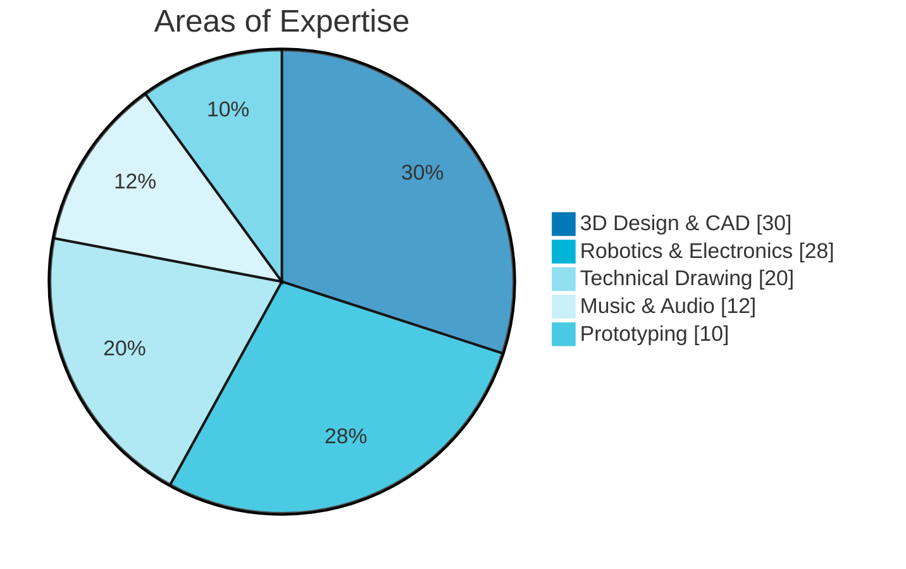
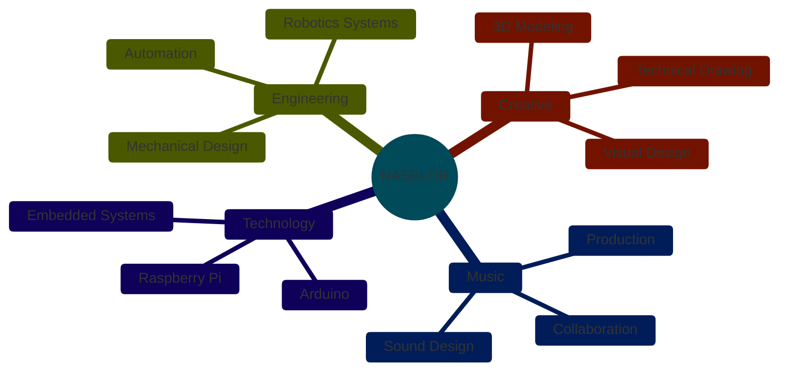

```mermaid
%%{init: {'theme': 'base', 'themeVariables': { 'primaryColor': '#0077B6', 'secondaryColor': '#90E0EF', 'tertiaryColor': '#CAF0F8', 'primaryTextColor': '#ffffff'}}}%%
flowchart LR
    A[💡 Concept] --> B[✏️ Sketch]
    B --> C[📐 CAD Design]
    C --> D[🎨 3D Model]
    D --> E[⚙️ Prototype]
    E --> F[🤖 Build]
    style A fill:#0077B6,stroke:#023E8A,color:#fff
    style B fill:#00B4D8,stroke:#0077B6,color:#fff
    style C fill:#48CAE4,stroke:#00B4D8,color:#023E8A
    style D fill:#90E0EF,stroke:#48CAE4,color:#023E8A
    style E fill:#ADE8F4,stroke:#90E0EF,color:#023E8A
    style F fill:#CAF0F8,stroke:#ADE8F4,color:#023E8A
```

<div align="center">


</div>

##

<div align="center">
&nbsp;&nbsp;&nbsp;<b>ABOUT ME</b>&nbsp;&nbsp;&nbsp;
</div>


```yaml
name: Nasblor
location: Brazil
focus: Engineering & Creative Design
passions:
  - Robotics & Automation
  - 3D Modeling & Visualization  
  - Technical Drawing & CAD
  - Music Production & Collaboration
currently: Building amazing things
```

◈ Engineering student passionate about **robotics** and **automation**
◈ Creating **3D models** and **technical designs** for real-world solutions
◈ **Music enthusiast** collaborating on creative projects
◈ Transforming concepts into **functional prototypes**

##

<div align="center">
&nbsp;&nbsp;&nbsp;<b>TECH STACK</b>&nbsp;&nbsp;&nbsp;
</div>

<div align="center">
<table><tr><td valign="top" width="50%">

**⚡ ROBOTICS & HARDWARE**
<p>


</p>

</td><td valign="top" width="50%">

**🎨 DESIGN & 3D**
<p>


</p>

</td></tr></table>
</div>

<div align="center">
&nbsp;
&nbsp;
&nbsp;
&nbsp;

</div>

##

<div align="center">
&nbsp;&nbsp;&nbsp;<b>SKILL OVERVIEW</b>&nbsp;&nbsp;&nbsp;
</div>



##

<div align="center">
&nbsp;&nbsp;&nbsp;<b>WORKFLOW</b>&nbsp;&nbsp;&nbsp;
</div>



<div align="center">

</div>

##

<div align="center">
&nbsp;&nbsp;&nbsp;<b>INTERESTS</b>&nbsp;&nbsp;&nbsp;
</div>

<div align="center">

`🤖 Robotics` `⚡ Automation` `🎨 3D Art` `📐 Engineering` `🎵 Music Production` `🎧 Audio Design` `✏️ Technical Drawing` `🔧 Prototyping` `💡 Innovation` `🎮 Creative Tech`

</div>



##

<div align="center">
&nbsp;&nbsp;&nbsp;<b>CONNECT WITH ME</b>&nbsp;&nbsp;&nbsp;
</div>

<div align="center">
<a href="https://instagram.com/nasblor"></a>&nbsp;
<a href="https://twitter.com/nasblor"></a>&nbsp;
<a href="https://linkedin.com/in/nasblor"></a>&nbsp;
<a href="https://behance.net/nasblor"></a>&nbsp;
<a href="https://soundcloud.com/nasblor"></a>
</div>

##

<div align="center">


</div>

##

<div align="center">

</div>


</div>
