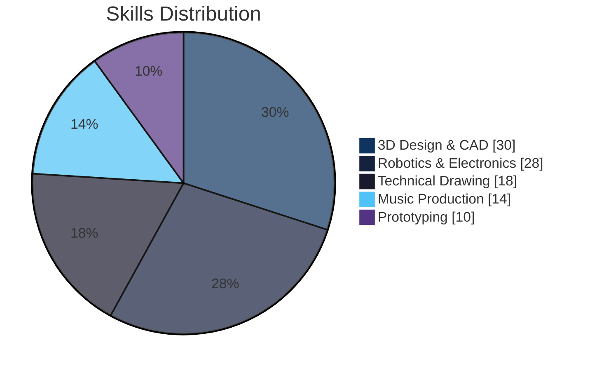
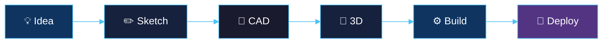
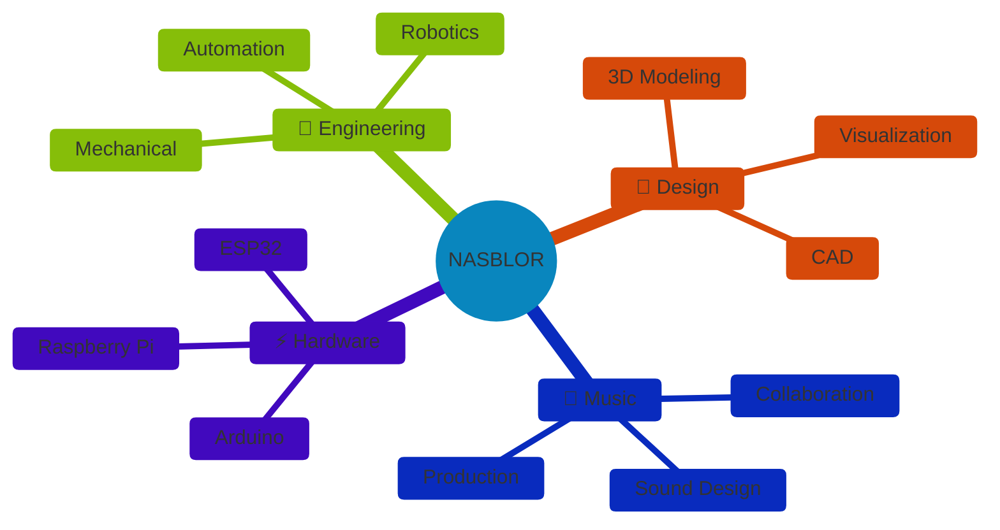

<div align="center">


# ✦ NASBLOR ✦


<br>

<a href="https://instagram.com/nasblor"></a>
<a href="https://twitter.com/nasblor"></a>
<a href="https://behance.net/nasblor"></a>
<a href="https://soundcloud.com/nasblor"></a>

</div>


## ◈ About

```yaml
name: Nasblor
role: Engineer & Creative Designer
location: Brazil 🇧🇷
focus: Robotics × 3D × Music
status: Creating something amazing
```

◈ Engineering student focused on **robotics** and **automation**

◈ Passionate about **3D modeling** and **technical design**

◈ **Music enthusiast** and creative collaborator

◈ Building the future with **innovative prototypes**

<br clear="both">

<div align="center">

</div>

## ◈ Tech Arsenal

<div align="center">

**⚡ ROBOTICS & EMBEDDED**


**🎨 DESIGN & 3D TOOLS**


**🎵 AUDIO & CREATIVE**


</div>

## ◈ Expertise

<div align="center">



</div>

## ◈ Workflow

<div align="center">




</div>

## ◈ Creative Universe

<div align="center">



</div>

## ◈ Interests

<div align="center">

`🤖 Robotics` `⚡ Automation` `🎨 3D Art` `📐 Engineering` `🎵 Music` `✏️ Drawing` `🔧 Prototyping` `💡 Innovation`

</div>

## ◈ Stats

<div align="center">

&nbsp;&nbsp;


</div>

## ◈ Connect

<div align="center">

&nbsp;&nbsp;**Let's create something incredible together**&nbsp;&nbsp;

<br>

<a href="mailto:nasblor@email.com"></a>
<a href="https://instagram.com/nasblor"></a>
<a href="https://linkedin.com/in/nasblor"></a>

</div>

<div align="center">


</div>
