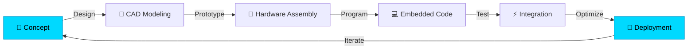
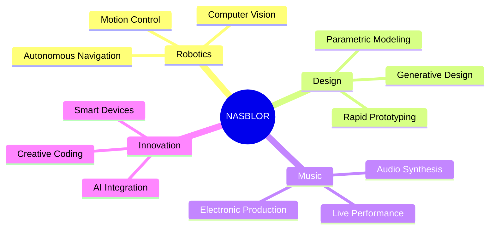

# 🚀 NASBLOR

---

## 🎯 About Me

**Engineering meets creativity** — I'm a robotics engineer passionate about merging technology with design and music. My world revolves around building intelligent systems, crafting 3D models, and exploring sonic landscapes.

🤖 Robotics enthusiast specializing in automation and intelligent systems  
🎨 3D modeling and design for engineering applications  
🎵 Music collaborator and audio technology explorer  
⚙️ Hardware and embedded systems developer  

---

## 🛠️ Tech Stack

### 🤖 Robotics & Engineering

### 🎨 Design & 3D Modeling

### 🎵 Music & Audio

---

## 📊 Engineering Workflow

---

## 🎓 Expertise Areas

🔹 **Robotics Development** — Autonomous systems, control algorithms, sensor integration  
🔹 **Mechanical Design** — 3D CAD modeling, prototyping, manufacturing optimization  
🔹 **Embedded Systems** — Microcontroller programming, IoT devices, real-time control  
🔹 **Audio Engineering** — Music production, sound design, signal processing  
🔹 **Creative Technology** — Intersection of art, music, and engineering innovation  

---

## 🎯 Current Focus

---

## 📈 GitHub Stats

---

## 🌐 Connect With Me

 

**Let's collaborate on robotics, design, or music projects!**

---

### 💡 Innovation Through Engineering & Creativity

**© 2026 Nasblor | Engineering · Design · Music**

