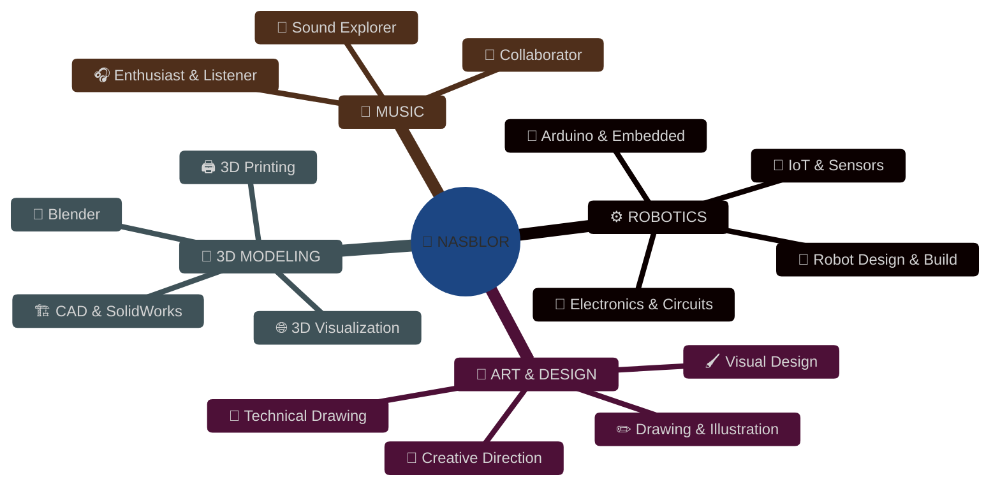
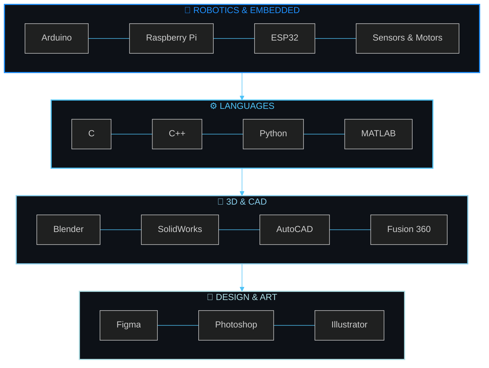
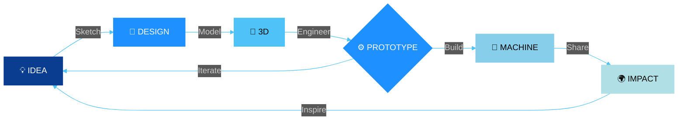
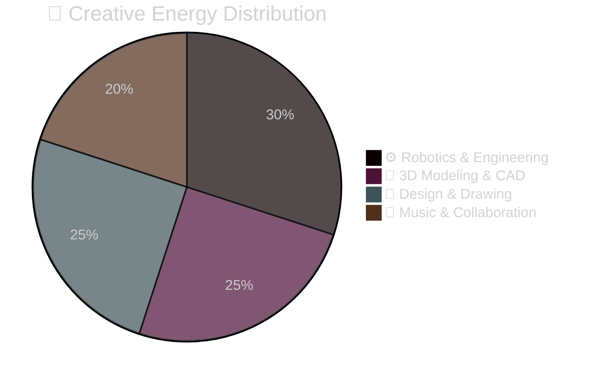

<div align="center">

<a href="https://git.io/typing-svg">

</a>
<br>

<br>


</div>

<div align="center">

## ◈ 𝗪𝗛𝗢 𝗔𝗠 𝗜 ◈

</div>



<div align="center">

## ◈ 𝗖𝗢𝗡𝗡𝗘𝗖𝗧 ◈


<br><br>
<b>📱 𝗦𝗢𝗖𝗜𝗔𝗟</b>
<br>
<a href="https://instagram.com/nasblor"></a>
<a href="https://youtube.com/@nasblor"></a>
<a href="https://twitter.com/nasblor"></a>
<a href="https://tiktok.com/@nasblor"></a>
<a href="https://threads.net/@nasblor"></a>
<br><br>
<b>🎨 𝗖𝗥𝗘𝗔𝗧𝗜𝗩𝗘 ⟐ 𝗘𝗡𝗚𝗜𝗡𝗘𝗘𝗥𝗜𝗡𝗚</b>
<br>
<a href="https://github.com/nasblor"></a>
<a href="https://behance.net/nasblor"></a>
<a href="https://www.artstation.com/nasblor"></a>
<a href="https://dribbble.com/nasblor"></a>

</div>

<div align="center">

## ◈ 𝗧𝗘𝗖𝗛 𝗔𝗥𝗦𝗘𝗡𝗔𝗟 ◈


</div>



<div align="center">


</div>

<div align="center">

## ◈ 𝗦𝗧𝗔𝗧𝗦 ◈


<br>

<br>


</div>

<div align="center">

## ◈ 𝗪𝗢𝗥𝗞𝗙𝗟𝗢𝗪 ◈


</div>



<div align="center">


</div>

```python
nasblor = RoboticsEngineer({
    "craft": ["Robotics", "3D Modeling", "Design", "Drawing"],
    "passion": "Music Enthusiast",
    "tools": ["Arduino", "Blender", "SolidWorks", "Figma"],
    "mission": "Engineering the future, one prototype at a time"
})

while nasblor.inspired:
    sketch = nasblor.draw_concept()
    model = nasblor.model_3d(sketch)
    prototype = nasblor.engineer(model)
    nasblor.share_with_world(prototype)
```

<div align="center">

## ◈ 𝗖𝗢𝗡𝗧𝗥𝗜𝗕𝗨𝗧𝗜𝗢𝗡𝗦 ◈


## ◈ 𝗔𝗖𝗛𝗜𝗘𝗩𝗘𝗠𝗘𝗡𝗧𝗦 ◈


<br>

[](https://github.com/ryo-ma/github-profile-trophy)

</div>



<div align="center">

 <b>Let's connect and build something amazing!</b> 
<br><br>

<br>
<a href="https://github.com/nasblor"></a>
<br><br>


</div>
