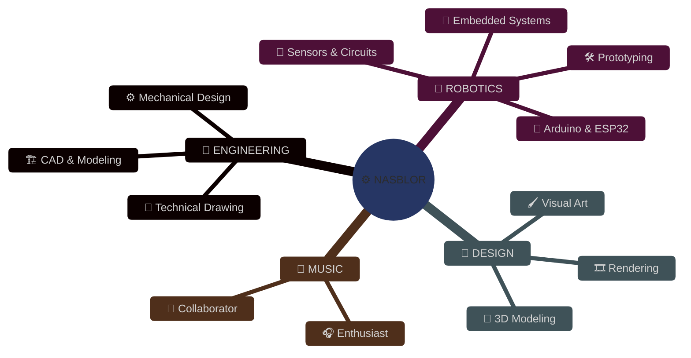
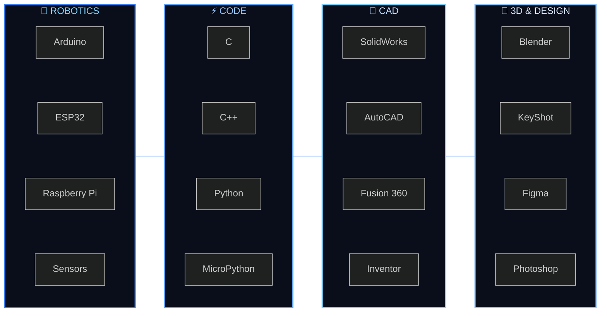
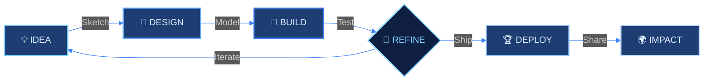

   

```mermaid
%%{init:{'theme':'dark','themeVariables':{'primaryColor':'#3b82f6','primaryTextColor':'#e0f2fe','primaryBorderColor':'#7dd3fc','lineColor':'#60a5fa','secondaryColor':'#0a0e1a','tertiaryColor':'#0f1f42','fontSize':'13px'}}}%%
mindmap
  root((⚙️ NASBLOR))
    🔧 ENGINEERING
      📐 Technical Drawing
      🏗️ CAD & Modeling
      ⚙️ Mechanical Design
    🤖 ROBOTICS
      🦾 Arduino & ESP32
      🔌 Embedded Systems
      📡 Sensors & Circuits
      🛠️ Prototyping
    🎨 DESIGN
      💎 3D Modeling
      🎞️ Rendering
      🖌️ Visual Art
    🎵 MUSIC
      🎧 Enthusiast
      🎤 Collaborator
```

        

```mermaid
%%{init:{'theme':'dark','themeVariables':{'primaryColor':'#7dd3fc','primaryTextColor':'#fff','primaryBorderColor':'#60a5fa','lineColor':'#3b82f6','secondaryColor':'#0a0e1a','tertiaryColor':'#0f1f42'}}}%%
graph LR
    subgraph A["🤖 ROBOTICS"]
        A1[Arduino] ~~~ A2[ESP32] ~~~ A3[Raspberry Pi] ~~~ A4[Sensors]
    end
    subgraph B["⚡ CODE"]
        B1[C] ~~~ B2[C++] ~~~ B3[Python] ~~~ B4[MicroPython]
    end
    subgraph C["📐 CAD"]
        C1[SolidWorks] ~~~ C2[AutoCAD] ~~~ C3[Fusion 360] ~~~ C4[Inventor]
    end
    subgraph D["🎨 3D & DESIGN"]
        D1[Blender] ~~~ D2[KeyShot] ~~~ D3[Figma] ~~~ D4[Photoshop]
    end
    A --- B --- C --- D
    style A fill:#0a0e1a,stroke:#3b82f6,stroke-width:2px,color:#7dd3fc
    style B fill:#0a0e1a,stroke:#60a5fa,stroke-width:2px,color:#93c5fd
    style C fill:#0a0e1a,stroke:#7dd3fc,stroke-width:2px,color:#bfdbfe
    style D fill:#0a0e1a,stroke:#93c5fd,stroke-width:2px,color:#dbeafe
```

```mermaid
%%{init:{'theme':'dark','themeVariables':{'primaryColor':'#7dd3fc','primaryTextColor':'#000','lineColor':'#3b82f6','secondaryColor':'#0f1f42','tertiaryColor':'#0a0e1a'}}}%%
flowchart LR
    A["💡 IDEA"] -->|Sketch| B["📐 DESIGN"]
    B -->|Model| C["🔧 BUILD"]
    C -->|Test| D{"🤖 REFINE"}
    D -->|Iterate| A
    D -->|Ship| E["🏆 DEPLOY"]
    E -->|Share| F["🌍 IMPACT"]
    style A fill:#1e3d73,stroke:#7dd3fc,color:#e0f2fe,stroke-width:2px
    style B fill:#1e3d73,stroke:#60a5fa,color:#e0f2fe,stroke-width:2px
    style C fill:#1e3d73,stroke:#3b82f6,color:#e0f2fe,stroke-width:2px
    style D fill:#0f1f42,stroke:#7dd3fc,color:#7dd3fc,stroke-width:2px
    style E fill:#1e3d73,stroke:#93c5fd,color:#e0f2fe,stroke-width:2px
    style F fill:#1e3d73,stroke:#bfdbfe,color:#e0f2fe,stroke-width:2px
```

 

```mermaid
%%{init:{'theme':'dark','themeVariables':{'primaryColor':'#7dd3fc','primaryTextColor':'#fff','lineColor':'#60a5fa'}}}%%
pie title 🧠 Focus Distribution
    "🤖 Robotics & Electronics" : 30
    "⚙️ Engineering & CAD" : 25
    "🎨 3D & Design" : 25
    "🎵 Music & Collaboration" : 20
```

 <b>Let's connect and build something extraordinary!</b> 
 

